## git hub Quick start  
---  
### หัวข้อ  
> github ฉบับ backup my code  
>
> การสมัคร git hub  
>
> การติดตั้ง git  
>
> push สิครับ  
---  
**github ฉบับ backup my code**  
วิธีการเรียนรู้การใช้ git และ github ที่สั้นที่สุดคือการทำงาน 4 ขั้นตอนต่อไปนี้  
1. สร้างบัญชี github  
2. ติดตั้งโปรแกรม git  
3. สร้าง local repo  
4. push local repo ไปไว้ที่ github  

คุณจะสามารถเข้าถึง code ของคุณไม่ว่าจาก browser ใดๆ  

git เป็น software ด้าน version control กล่าวคร่าวๆคือ อำนวยให้คุณสามารถย้อนกลับไปยัง version ใดๆที่คุณสั่ง commit ไว้  
github.com เป็น platform ที่ทำงานร่วมกับ git โดยคุณสามารถ push ไฟล์ที่คุณทำงานไว้กับ git (ขอบเขตของบทความนี้ไม่รวมการ pull, clone กลับลงมา) ไปไว้ที่บริการนี้  

:point_right: การสร้างบัญชี github
หากยังไม่มีบัญชี ให้ไปที่ https://github.com/ เพื่อ sign up (ภาพประกอบจาก https://www.codecademy.com/article/how-to-set-up-a-github-account) 
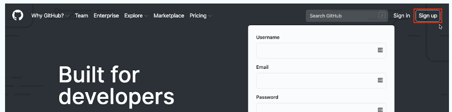  

:point_right:การติดตั้ง git 
download git จาก https://git-scm.com/downloads แล้วติดตั้ง (ภาพประกอบจาก https://www.datacamp.com/tutorial/git-install-tutorial)   
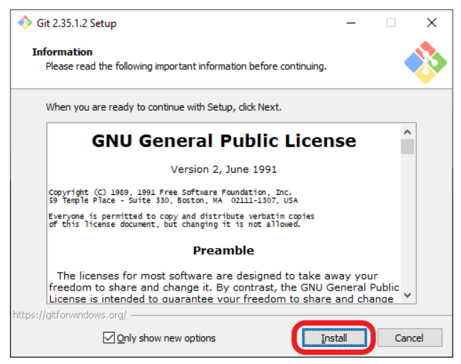

ในขั้นต้นสามารถใช้ค่า default ได้หมด
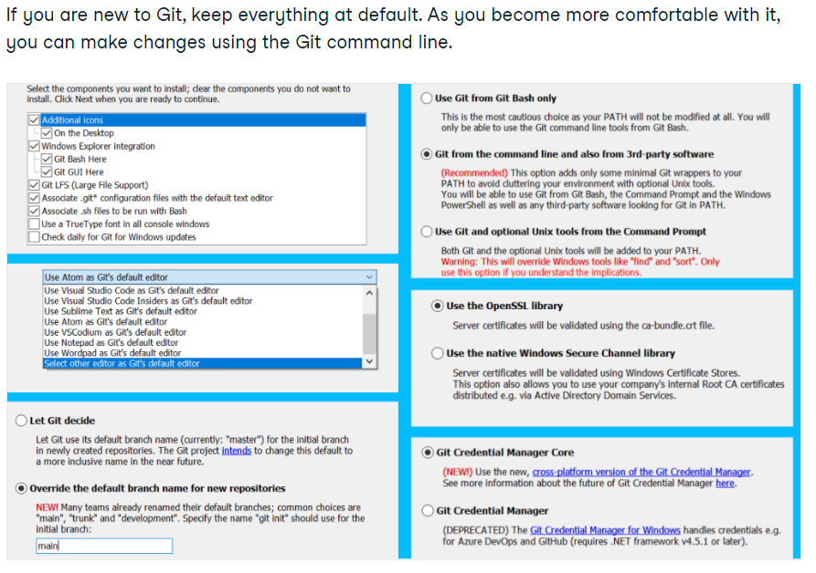  

หลังจากติดตั้งเสร็จแล้ว บทความนี้จะใช้เครื่องมือพื้นฐาน คือ git bash 
git bash คือ prompt สำหรับสั่งงาน git (มีไวยากรณ์เหมือน linux) 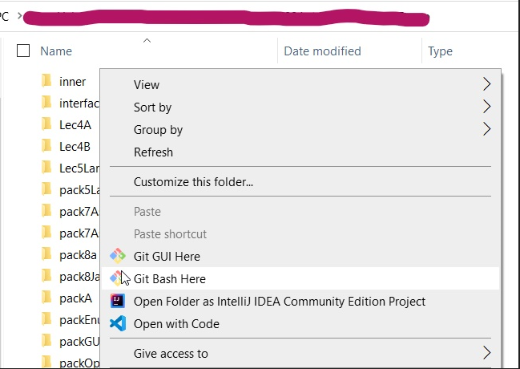  

วิธีที่ง่ายที่สุดคือ ไปยังแฟ้มที่คุณต้องการใช้งาน git คลิ๊กขวาแล้วเลือก git bash here
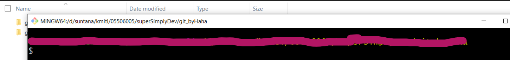  

หากอยู่ผิด folder คุณสามารถใช้คำสั่ง cd เพื่อไปอยู่ที่ folder ที่ต้องการ (ข้อควรระวังสำหรับสายวินโดวส์คือ สัญลักษณ์คั่น subfolder ใช้ / ไม่ใช่ \\)  

เรื่องเล็กๆที่ควรทำให้เรียบร้อยคือใช้คำสั่ง git config เพื่อตั้งค่า user.name และ user.email ให้เรียบร้อย 
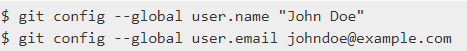   
ภาพประกอบจาก https://git-scm.com/book/en/v2/Customizing-Git-Git-Configuration  

หากคุณลืมขั้นตอนนี้ ทุกครั้งในอนาคตที่คุณ commit งาน git จะใช้ค่า default บันทึกใน commit log ทำให้เมื่อคุณไปทำงานจริงกับทีม จะเป็นการเสียมารยาท เพราะเขาอาจประสบปัญหาในการทราบว่า code นั้นใครเป็นคนทำ   

:point_right: สร้าง local repo
สั่ง `git init`
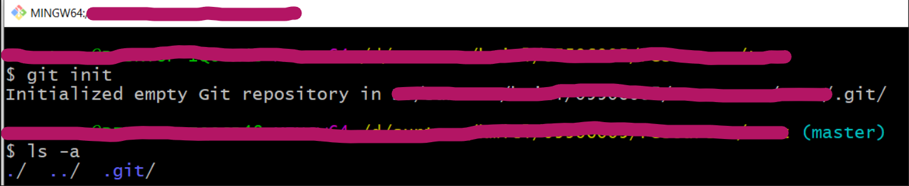  

ผลการ initialize git จะได้ .git (hidden folder ชื่อ git)   
ลองสร้างไฟล์ชื่อ ToBeJavaCode.java
ภาพประกอบด้านซ้ายแสดง vscode สามารถทำงานร่วมกับ git ได้ ด้านขวาแสดง .git ซึ่งเป็น folder เก็บ (track) การเปลี่ยนแปลงทุกอย่างด้วยการทำงานของ git  
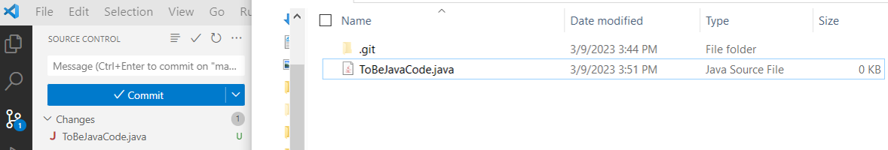  

เมื่อเสร็จงานแล้ว (พิมพ์ content ของ ToBeJavaCode.java เอง)
สั่ง `git add .` และ `git commit -m "step one completed"`
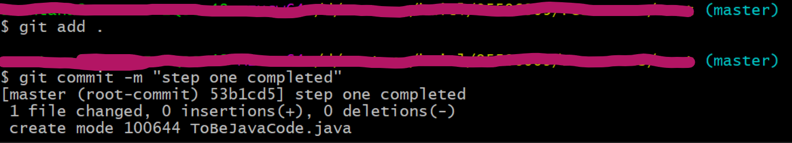  

ก่อนสั่ง git commit ต้องสั่ง **git add .** โดย . หมายถึงทุก files และ folders เป็นการแจ้ง git ว่าที่ไฟล์ที่ git track อยู่นั้น จะ commit ไฟล์ไหนบ้าง ส่วนคำสั่ง commit ที่ง่ายที่สุดคือ **git commit -m "memo"** หมายถึงการบันทึกข้อความว่าการ commit ครั้งนี้เกี่ยวกับอะไร เนื่องจาก git เป็น version control จึงมี feature ให้บันทึกข้อความช่วยให้จำได้ว่า version นั้นๆ ทำอะไรบ้าง จึงเป็นธรรมเนียมว่า ใส่ -m "memo" ทุกครั้ง  

:point_right: การ push 
ไปที่ github สั่ง new repository เพื่อรับการ push จาก local repo   
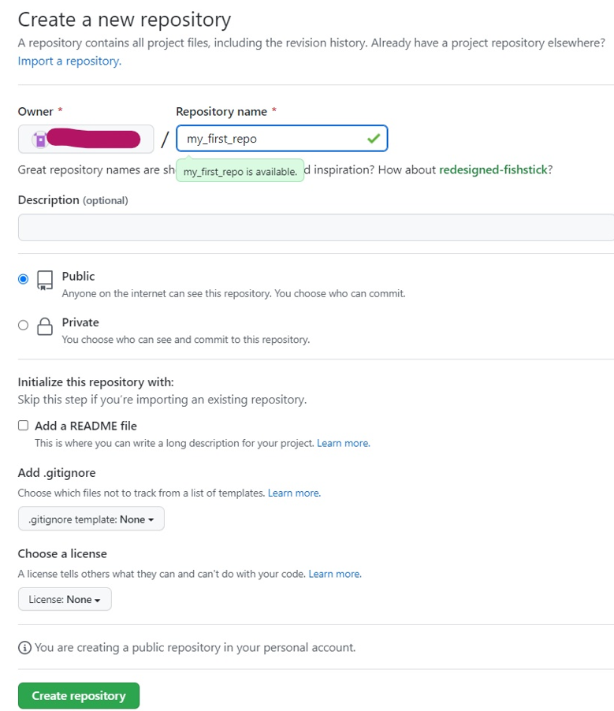

git แสดงผลลัพธ์การสร้าง repo สำเร็จด้วย Quick setup สำหรับการใช้งาน  
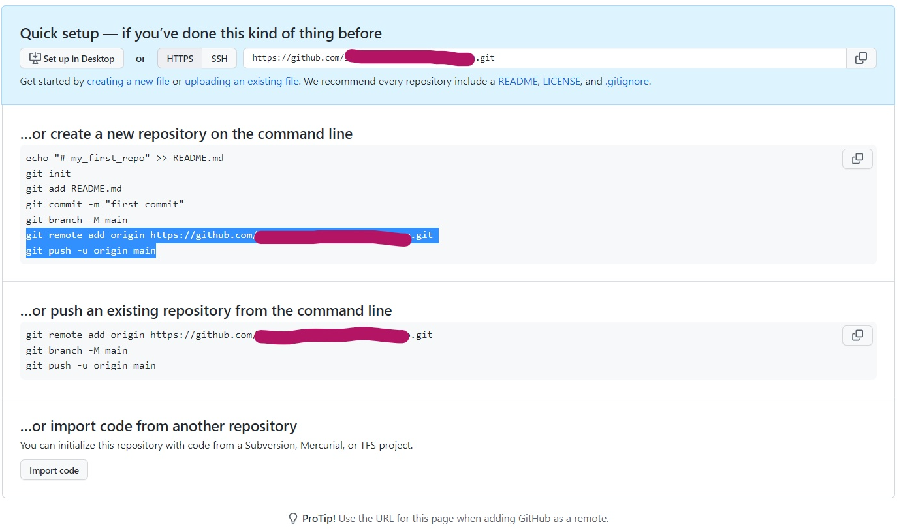

สังเกต https URL ตรงกับใน Quick setup พร้อมให้คุณ copy ไปใช้ และสังเกตว่า github สามารถให้ผู้ใช้ สร้างไฟล์ผ่าน browser ได้เลย  
หากหา https ไม่เจอ ปกติให้หาที่ ปุ่ม code ดังแสดง  
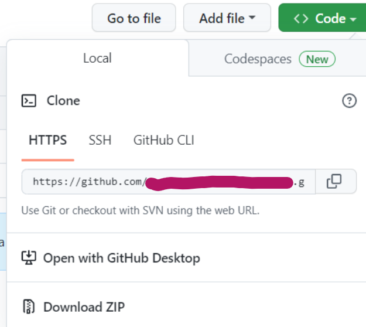

ดังที่ปรากฏใน quick start หลังจากสร้าง remote repo ว่าให้สั่ง git remote add ความหมายคือ   
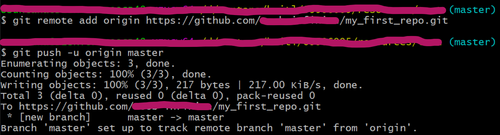  
`git remote add origin https:\\`
คือการสร้าง (ถ้านึกไม่ออกว่าทำไมใช้คำว่าสร้าง ศึกษาเพิ่มเติมล่วงหน้าได้) ตัวแปร origin ว่าปลายทางอยู่ที่ remote repo ไหน  
คำสั่ง `git push -u origin master` สังเกตว่าไม่เหมือนกับ quick start เพราะปัจจุบัน git สร้าง repo ที่เรียกว่า master ไม่ใช่ main (สำหรับบัญชี github ที่ไม่เคยตั้งค่า login ไว้ github จะถาม password)  

เมื่อ push สำเร็จ ไฟล์ของเราจะอยู่ใน remote repo  
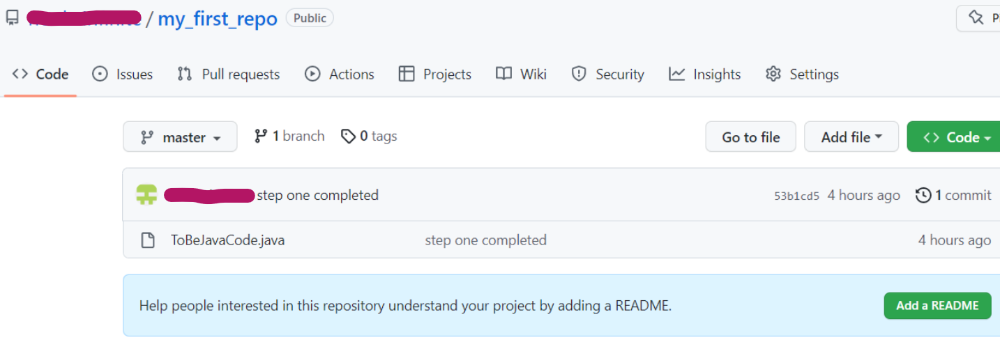  

### Key Points:
> ติดตั้ง git ก่อนก็ได้ (แต่ sign up github ง่ายกว่าจึงแยกไปทำก่อน)
> ใช้ git ผ่าน git bash
>> git init, git add, git commit
>> (สร้าง remote repo แล้ว) git remote add เพื่อระบุ remote repo ให้ git
>> git push 

### หมายเหตุ
- [x] Readme.md  คือไฟล์เอกสารอธิบายเนื้อหาของ repo หรือโปรแกรม .md คือไฟล์ mark down อันเป็นภาษาตระกูลเดียวกับ html อำนวยความสะดวกในการสร้างเอกสาร สามารถสร้างเองภายหลัง หรือให้ github สร้างให้ตอนสร้าง repo ก็ได้
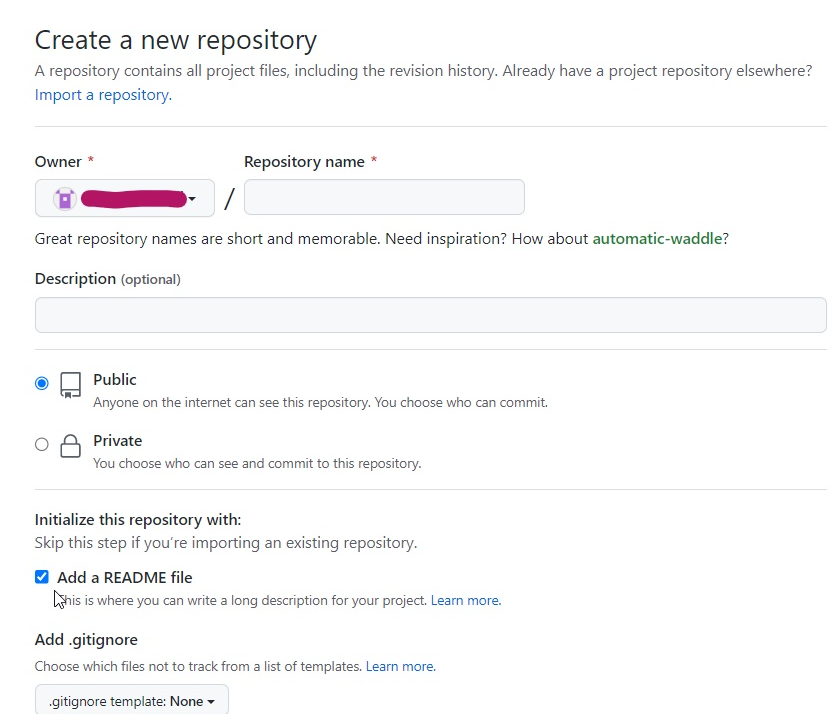

### Recommended Resource / Readings  
[markdown-basic-syntax](https://www.markdownguide.org/basic-syntax/)  
[Markdown Cheat Sheet](https://www.interviewbit.com/markdown-cheat-sheet/)  
[Official Git Book (2014)](https://git-scm.com/book/en/v2)  
