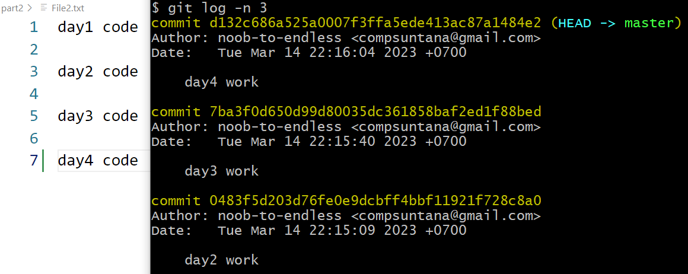
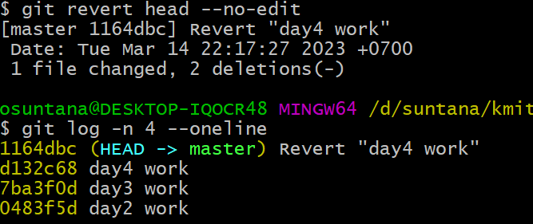
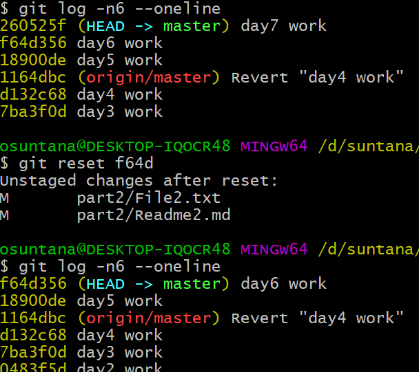
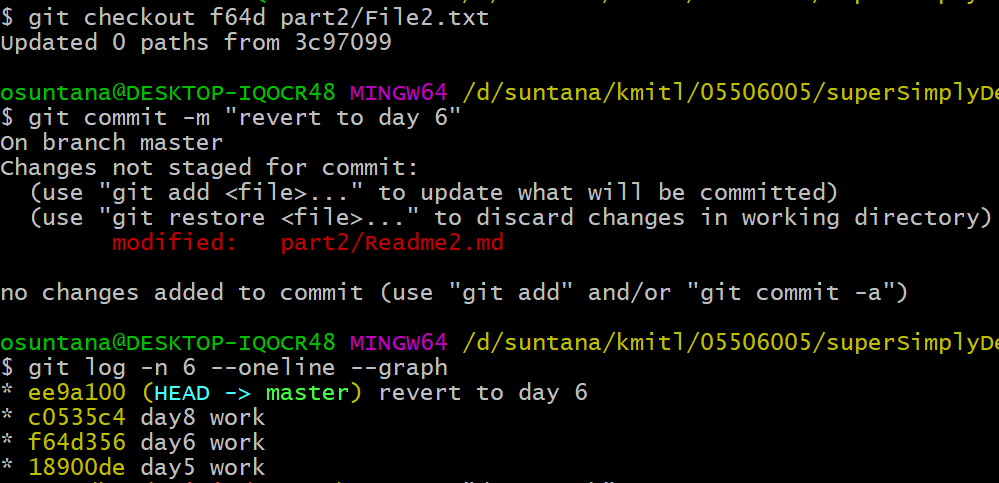
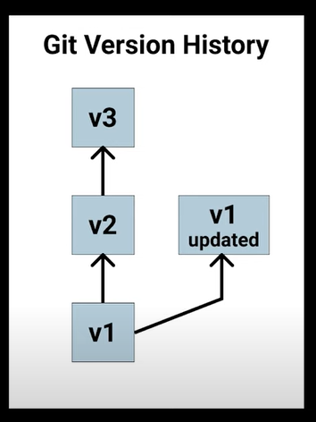

## Beginner git commands for version control  
---  
### หัวข้อ
>git status  
>git add  
>git commit  
>git log  
>(intermediate) basic undoing techniques
---  
1. สร้าง folder Lab2_git  
2. สั่ง `git init`  
3. สร้าง File2.txt  

concept ของ git คือการเก็บ commit ที่ user สั่ง commit ไว้  

ภาพแสดง file status life cycle
https://git-scm.com/book/en/v2/images/lifecycle.png  

4. พิมพ์ day1 work ใน File2.txt แล้ว save (สมมติว่าเป็นงานที่ทำวันนี้)  
5. สร้าง Readme2.md  
:point_right:  
6. สั่ง `git status`   

  

ก่อนที่จะพิจารณา output ของตัวอย่างของคำสั่ง git status จะกล่าวถึงลูกศร commit ดังที่กล่าวไว้ถึง concept ของ git ว่า เมื่อ user commit การเปลี่ยนแปลง content ของไฟล์นั้นๆ ไฟล์นั้นๆย่อมอยู่ในสถานะพร้อมสำหรับการแก้ไขครั้งต่อไป (unmodified)  

ภาพประกอบสำคัญอีกภาพหนึ่งคือ

https://dev.to/sublimegeek/git-staging-area-explained-like-im-five-1anh  

ความหมายของภาพนี้โยงกับภาพแรก คือ ไฟล์ที่จะ commit ได้ จะสั่งผ่านคำสั่ง git add เพื่อให้ git ทราบว่าจะต้องทำงานไฟล์ใด (.git ทำการ track การเปลี่ยนแปลง content ทุกไฟล์ตลอดเวลาอยู่แล้ว) เทียบกับภาพแรกคือลูกศร stage the file (ลูกศร add the file จาก untracked git ไม่ได้ห้ามไม่ให้ add) ดังนั้น การ add คือการทำให้ไฟล์อยู่ในสถานะ staged โดย commit จะทำงานเฉพาะกับ staged ไฟล์  

จากภาพ output ของ git status จะเห็นว่า git แจ้งว่ามีการเปลี่ยนแปลงกับไฟล์ File2.txt  พร้อมกับแนะนำให้ใช้ git add (จะได้สามารถสั่งให้ commit)  
และ git แจ้งว่ามีไฟล์ Readme.md อยู่ในสถานะ untracked (unstaged)  
:point_right:
7. สั่ง `git add .` (ทุกไฟล์ใน local folder)  
:point_right:
8. สั่ง `git commit -m "commit 1 : day1 code and empty Readme2.md"`  
9. สั่ง `git status`  

  
output จาก คำสั่งที่ 7 - 9 แสดงให้เห็นลำดับกระบวนการทำงานเพื่อการ commit ของ git กล่าวคือ stage file ด้วยคำสั่ง **git add** หลังจาก commit แล้ว ก็นับว่าจบกระบวนการ file change tracking   

ไวยากรณ์ของคำสั่ง git commit ที่ง่ายที่สุดคือ **git commit -m "messsage"** โดยที่ message คือข้อความที่ git จะบันทึกไว้เพื่อให้ user ทราบว่าการเปลี่ยนแปลงที่บันทึก (commit) ไปนั้นเรื่องอะไร  

10. เพิ่มเนื้อหาใน File2.txt ด้วย day2 work แล้ว save  
11. สั่ง `git add .`  
12. สั่ง `git commit -m "day2 code"`  
13. เพิ่มเนื้อหาใน File2.txt ด้วย day3 work แล้ว save  
14. สั่ง `git add .`  
15. สั่ง `git commit -m "day3 code"`  
14. เพิ่มเนื้อหาใน File2.txt ด้วย day4 work แล้ว save  
15. สั่ง `git add .`  
16. สั่ง `git commit -m "day4 code"`  
:point_right:
16. สั่ง `git log -n 3` เพื่อดู commit 3 ครั้งล่าสุด  
  

ประโยชน์ของการทำ version control คือเราสามารถย้อนกลับไปดูแต่ละ snapshot ที่ commit ไว้  
คำสั่ง git log แสดงลำดับการ commit โดยมี commit id (commit hash) กำกับ  
สังเกต head กับ master ซึ่งที่ผ่านมาชี้ไปที่ commit เดียวกันเสมอ  
การแสดงผลของคำสั่ง git log หากพื้นที่แสดงผลไม่พอ คำสั่งจะรอการเลื่อนหน้า ...สังเกตสัญลักษณ์ : ด้านล่างของจอ กด q เพื่อออกจากโหมดและคืน prompt  
:point_right:
17. คำสั่งยกเลิกการ commit ครั้งล่าสุดคือ `git revert head --no-edit`
18. เมื่อสั่ง `git log -n 4 --oneline` จะแสดงผลเฉพาะ commit id 
 

สังเกตว่า commit id ของ day 4 work ยังอยู่ แต่ git แก้ไข file content และ สร้าง commit id ให้ใหม่ (หัวใจของการทำ version control)

19. commit งานเพิ่มไปอีก 3 วัน (day5 day6 day7)
20. git revert เป็นคำสั่งใหม่ ก่อน git revert คำสั่งที่ใช้สำหรับการย้อน commit คือ git reset สั่ง `git reset commit id` เมื่อสั่ง git log อีกครั้งสังเกตว่า head ย้ายลงมาอยู่ที่ commit log นั้นเท่านั้น (content ถูกแก้ไขให้สอดคล้องกับ commit id ที่ระบุไป)

git reset มี 3 โหมด --soft --mixed และ --hard โดย default คือ --mixed (ดังที่สั่งไป) คร่าวๆ คือ --soft นั้น content ของ commit id 7 และ อื่นๆที่ใหม่กว่า ยังคงอยู่ในสถานะ staged ทำให้ หาก commit ใหม่ ผลของ commit ที่ใหม่กว่าจะกลับมา ส่วน --hard จะลบ commit นั้นๆออกไปเลย จึงเป็น option ที่อันตราย ควรศึกษาเพิ่มเติมก่อนใช้กับงานที่ทำร่วมกับผู้อื่น

ภาพประกอบจาก https://initialcommit.com/blog/git-reset  

### Key Points:
> สร้าง repo ด้วย git init  
> stage files ด้วย git add .  
> ดู staged files ด้วย git status  
> commit การเปลี่ยนแปลงของ staged files ด้วย git commit -m ""  
> ดู log chain ด้วย git log  
> หากต้องการย้อนกลับไปเริ่มทำงานที commit ไหน ใช้ git checkout commit-hash(prefix) target-file  
> การเรียนรู้ git ให้ดู head ไว้  
> ลบ .git  (หากใช้เสร็จ)

### หมายเหตุ
:white_check_mark: .gitignore
สร้าง file .gitignore โดยใน file ระบุไฟล์ที่ไม่ต้องการให้ git track  

:white_check_mark: checkout เป็นคำสั่งสำหรับย้อนกลับ (roll back) ที่ใช้ง่าย (นอกเหนือจาก revert หรือ reset) สั่ง `git revert f64d [path]\File2.txt`

การย้อนกลับด้วย git checkout ต้องระบุ path ไม่เช่นนั้น checkout จากสร้าง branch ใหม่ให้ ทำให้การ commit ใหม่ ไม่อยู่ที่ branch เดิม
  
ภาพจาก Git and GitHub - 0 Experience to Professional in 1 Tutorial (Part 1) https://www.youtube.com/watch?v=hrTQipWp6co หากไม่ได้ระบุ path ในคำสั่ง git checkout ทำให้การทำงานต่อไปไม่มี v2 v3 มาเกี่ยวข้อง (คำสั่ง checkout จะกล่าวถึงในลำดับถัดไป)

### Recommended Resource / Readings  
[Git and GitHub - 0 Experience to Professional in 1 Tutorial (Part 1)]( https://www.youtube.com/watch?v=hrTQipWp6co)  
