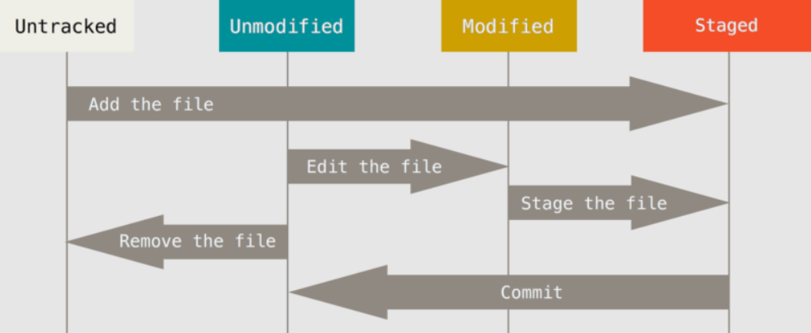
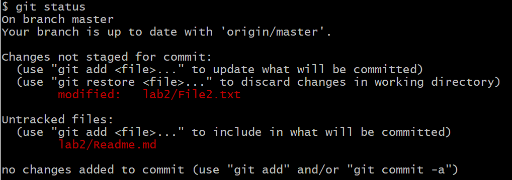
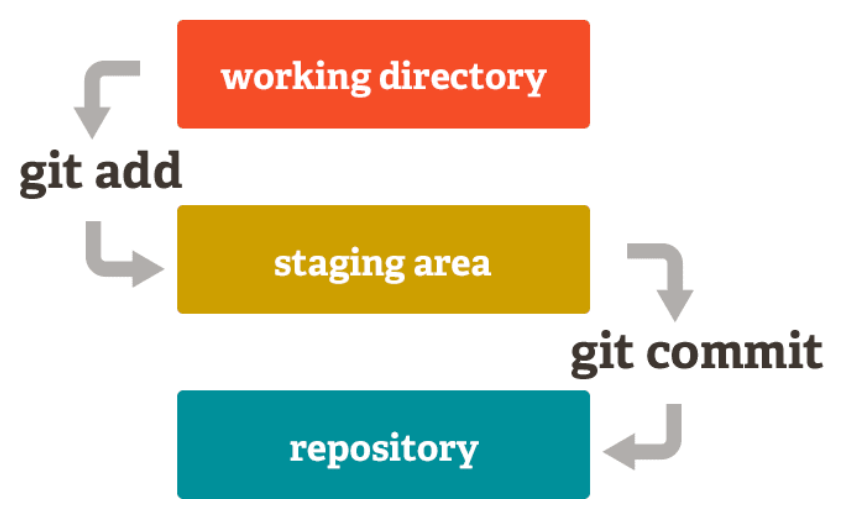
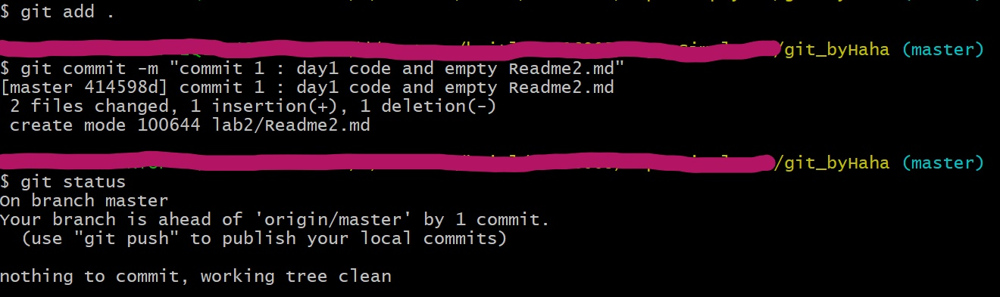
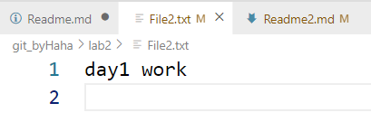
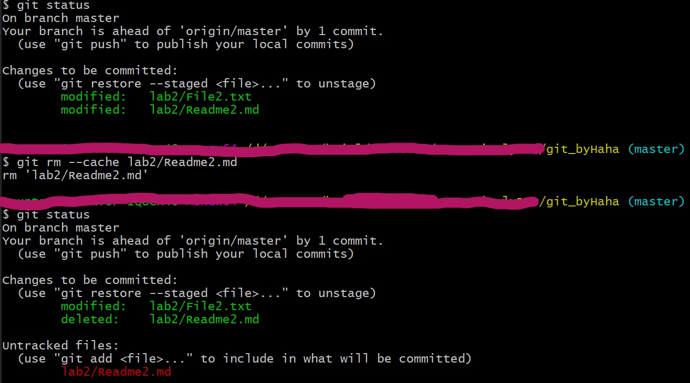
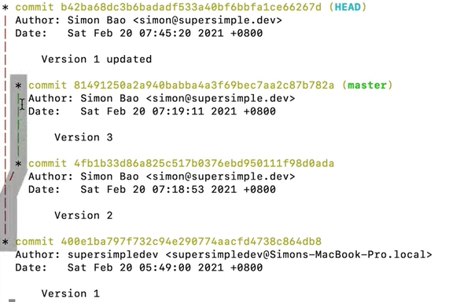
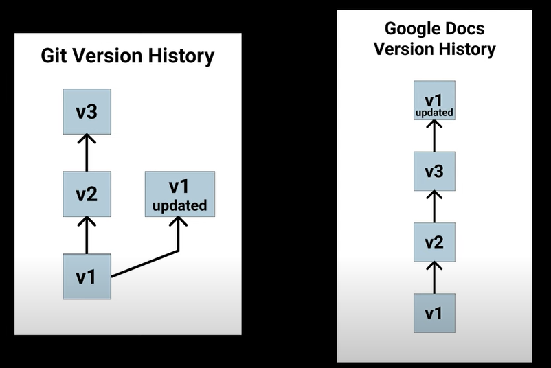
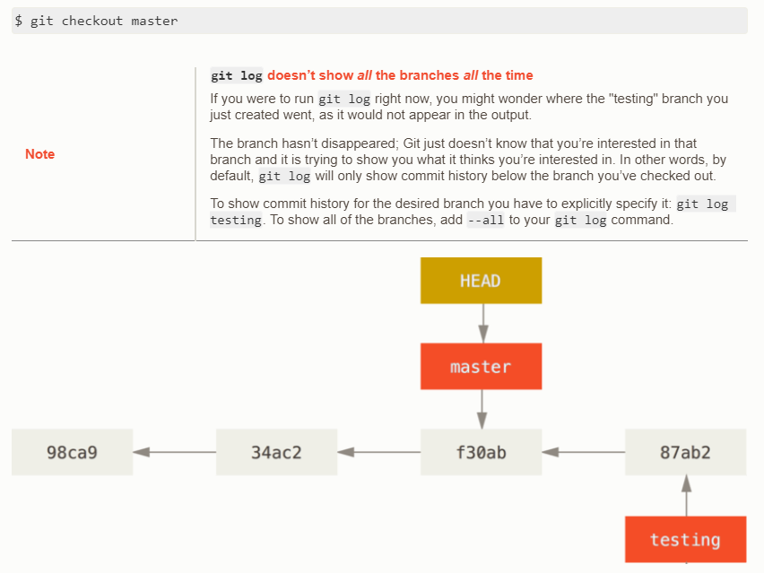

## Beginner git commands for version control  
---  
### หัวข้อ
>git status  
>git add  
>git commit  
>git log  
---  
1. สร้าง folder Lab2_git  
2. สั่ง `git init`  
3. สร้าง File2.txt  

concept ของ git คือการเก็บ commit ที่ user สั่ง commit ไว้  

ภาพแสดง file status life cycle
https://git-scm.com/book/en/v2/images/lifecycle.png  

4. พิมพ์ day1 work ใน File2.txt แล้ว save (สมมติว่าเป็นงานที่ทำวันนี้)  
5. สร้าง Readme2.md  
:point_right:  
6. สั่ง `git status`   

  

ก่อนที่จะพิจารณา output ของตัวอย่างของคำสั่ง git status จะกล่าวถึงลูกศร commit ดังที่กล่าวไว้ถึง concept ของ git ว่า เมื่อ user commit การเปลี่ยนแปลง content ของไฟล์นั้นๆ ไฟล์นั้นๆย่อมอยู่ในสถานะพร้อมสำหรับการแก้ไขครั้งต่อไป (unmodified)  

ภาพประกอบสำคัญอีกภาพหนึ่งคือ

https://dev.to/sublimegeek/git-staging-area-explained-like-im-five-1anh  

ความหมายของภาพนี้โยงกับภาพแรก คือ ไฟล์ที่จะ commit ได้ จะสั่งผ่านคำสั่ง git add เพื่อให้ git ทราบว่าจะต้องทำงานไฟล์ใด (.git ทำการ track การเปลี่ยนแปลง content ทุกไฟล์ตลอดเวลาอยู่แล้ว) เทียบกับภาพแรกคือลูกศร stage the file (ลูกศร add the file จาก untracked git ไม่ได้ห้ามไม่ให้ add) ดังนั้น การ add คือการทำให้ไฟล์อยู่ในสถานะ staged โดย commit จะทำงานเฉพาะกับ staged ไฟล์  

จากภาพ output ของ git status จะเห็นว่า git แจ้งว่ามีการเปลี่ยนแปลงกับไฟล์ File2.txt  พร้อมกับแนะนำให้ใช้ git add (จะได้สามารถสั่งให้ commit)  
และ git แจ้งว่ามีไฟล์ Readme.md อยู่ในสถานะ untracked (unstaged)  
:point_right:
7. สั่ง `git add .` (ทุกไฟล์ใน local folder)  
:point_right:
8. สั่ง `git commit -m "commit 1 : day1 code and empty Readme2.md"`  
9. สั่ง `git status`  

  
output จาก คำสั่งที่ 7 - 9 แสดงให้เห็นลำดับกระบวนการทำงานเพื่อการ commit ของ git กล่าวคือ stage file ด้วยคำสั่ง **git add** หลังจาก commit แล้ว ก็นับว่าจบกระบวนการ file change tracking   

ไวยากรณ์ของคำสั่ง git commit ที่ง่ายที่สุดคือ **git commit -m "messsage"** โดยที่ message คือข้อความที่ git จะบันทึกไว้เพื่อให้ user ทราบว่าการเปลี่ยนแปลงที่บันทึก (commit) ไปนั้นเรื่องอะไร  

10. เพิ่มเนื้อหาใน File2.txt ด้วย day2 work แล้ว save  
11. สั่ง `git add .`  
12. สั่ง `git commit -m "commit 2 : day2 code"`  
13. เพิ่มเนื้อหาใน File2.txt ด้วย day3 work แล้ว save  
14. สั่ง `git add .`  
15. สั่ง `git commit -m "commit 3 : day3 code"`  
:point_right:
16. สั่ง `git log`  
  

ประโยชน์ของการทำ version control คือเราสามารถย้อนกลับไปดูแต่ละ snapshot ที่ commit ไว้  
คำสั่ง git log แสดงลำดับการ commit โดยมี commit id (commit hash) กำกับ  
สังเกต head กับ master ซึ่งที่ผ่านมาชี้ไปที่ commit เดียวกันเสมอ  
โหมดการแสดงผลของคำสั่ง git log จะรอการเลื่อนหน้า ...สังเกตสัญลักษณ์ : ด้านล่างของจอ กด q เพื่อออกจากโหมดและคืน prompt  

17. คำสั่ง **git checkout commit-hash file-name** โดยสามารถใช้เฉพาะส่วนหน้า (prefix) เท่าที่ไม่ซ้ำกับ commit hash อื่นๆ   
17. สั่ง `git checkout 4145 .` คือคืนสภาพสู่ commit นั้น  
  

ลองสั่ง git log จะพบว่า head กับ master ยังชี้ไปที่ commit ล่าสุดเสมอ  
หมายความว่า หากเราต้องการปรับปรุงจาก commit 1 เป็น new commit 2 เราสามารถแก้ แล้ว add แล้ว commit เราจะได้ new commit 2 อยู่เหนือ commit 3 (ลอง :smirk:)  

เมื่อทำงานเสร็จ และต้องการจบ tracking ไว้ตรงนี้ ให้ลบ folder .git ออก หรือสั่ง `rm -rf .git` (คุณไม่อยากเก็บ .git ให้มีขนาดใหญ่ และปล่อยไว้ให้งานที่ควรเสร็จแล้วมีโอกาสถูก version เก่าทับ ...และคุณสามารถ git init เริ่มใหม่ได้เสมอ หรือ หาจาก github ในกรณีที่คุณ push ขึ้นไป)  

### Key Points:
> สร้าง repo ด้วย git init  
> stage files ด้วย git add .  
> ดู staged files ด้วย git status  
> commit การเปลี่ยนแปลงของ staged files ด้วย git commit -m ""  
> ดู log chain ด้วย git log  
> หากต้องการย้อนกลับไปเริ่มทำงานที commit ไหน ใช้ git checkout commit-hash(prefix) target-file  
> ลบ .git  

### หมายเหตุ
:white_check_mark: .gitignore
สร้าง file .gitignore โดยใน file ระบุไฟล์ที่ไม่ต้องการให้ git track  

:white_check_mark: การ unstaged ไฟล์  
เราสามารถปลด staged ไฟล์ได้ ด้วยคำสั่ง  
`git rm --cache Readme2.md`
  

:white_check_mark: การเผลอ branch ด้วย git checkout commit-hash
git log จะไม่แสดง commit ที่เกิดหลัง commit ที่ head ชี้ ...หากต้องการแสดง log ทั้งหมดใช่คำสั่ง  
`git log --all --graph`  
**สำคัญ** หากเราไม่ระบุไฟล์ จะเป็นการย้าย head พร้อมกับสร้าง branch ใหม่ (git checkout 400e)
   

ส่งผลให้หาก commit จะไม่ได้อยู่บน branch เดียวกัน (อันเป็นขอบเขตของ lab นี้) ภาพประกอบด้านล่าง การเกิด branch จะไม่ทำให้ commit ใหม่เป็น update ล่าสุดจาก commit 3 (ในเนื้อหาเราทำแบบภาพทางขวา)  
  
ภาพจาก Git and GitHub - 0 Experience to Professional in 1 Tutorial (Part 1) https://www.youtube.com/watch?v=hrTQipWp6co

อนึ่ง `git checkout master` เป็นรูปแบบหนึ่งของการกระโดดกลับมายัง update ล่าสุดได้ (หาก checkout ไปที่อื่นแล้วอยากกลับมา)  

เราสามารถแทน hash commit ด้วย alias ได้ โดยเฉพาะอย่างยิ่ง master ซึ่งหมายถึงให้ head ไปชี้ที่ master  
ภาพประกอบด้านล่างเมื่อ head ไปอยู่ที่ f30ab head จะไม่เห็น 87ab2  

https://git-scm.com/book/en/v2/Git-Branching-Branches-in-a-Nutshell  

### Recommended Resource / Readings  
[Git and GitHub - 0 Experience to Professional in 1 Tutorial (Part 1)]( https://www.youtube.com/watch?v=hrTQipWp6co)  
